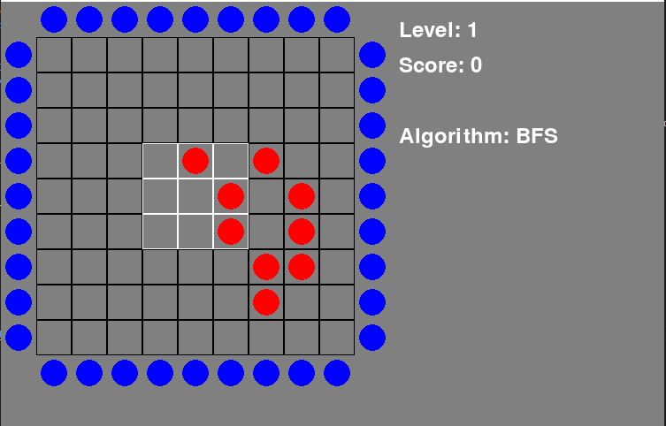

# Cogito : One Player Solitaire Game

## Introduction
Cogito is a solitaire game played on a 9x9 grid. The objective is to correctly position all the balls according to the level's rules. The game is won when all the balls are in their correct positions.

## Setup
The game was developed using python 3.10.11, but it should work with any python 3.x version. To install the required packages, run the following command:

```bash
pip install -r requirements.txt
```

To initialize the game, run the following command:

```bash
python main.py
```

## How to play
When the previous command is ran the following screen will appear:



This view displays the game board and its current state. The nine squares that need to be filled with balls to win the game are marked in white.

You can move the balls by clicking on the circles around the board. The effect of this action may differ based on the rules of the particular level, that the player should find out by himself. 

We have information about the current level, the number of moves made (score), and the current AI algorithm selected. The player can change the AI algorithm by using the "Left" and "Right" arrow keys.

